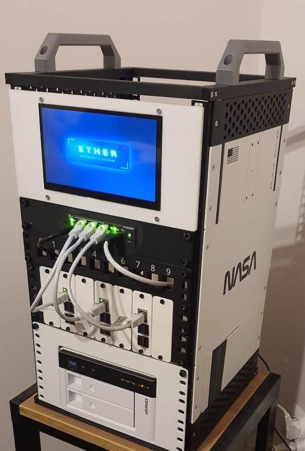

  

  Personal Kubernetes Homelab

## What’s inside

- `ansible/` - Ansible inventories, roles and playbooks used to bootstrap/maintain hosts
- `argo/` - Argo CD apps / app-of-apps definitions (GitOps manifests)
- `certificates/` - Certificate-related assets (CA, leaf certs, issuance configs, etc.)
- `ssh-keys/` - SSH keys
- `justfile` - Common automation tasks
- `docs/` - Documentation

## Tools used

- `k3s` for a lightweight Kubernetes implementation
- **Ansible** for provisioning the nodes and making k3s work
- **ArgoCD** for a GitOps approach to managing applications inside the cluster
- **Kustomize** (with **Helm** enabled) for declarative
- **SOPS** for encrypting sensitive data with a GPG key
- `just` + **Justfile** for declaring common operations

## Hardware

  

This homelab currently runs on 3x Raspberry Pi 5 Nodes with a [Waveshare PoE M.2 HAT+](https://www.waveshare.com/wiki/PoE_M.2_HAT+) and a 512 GB SSD M.2 disk on each node.

The local storage is managed by Longhorn for data replication. This storage is intended for ephemeral and non-critical data.

There is also an external NAS server for permanent data.

## Software

For more details on what is running inside Ether, see the `argo/` directory.

Here's a quick non-exhaustive list:
* Authelia
* Personal blog
* Cert Manager
* Cloudflare Tunnel
* Github Actions Runners
* Homepage (dashboard)
* Immich
* Longhorn
* MetalLB
* N8N
* Ntfy
* PaperlessNGX
* PiHole
* Prometheus + Grafana
* Sealed Secrets
* Umami
* Uptime Kuma

## How to run it

> Note: Due to the personal nature of this project, the setup process might contain issues that require manual resolving

1. Go to the `ansible` directory and follow instructions to provision the Raspberry Pi 5 nodes
2. Go to the `argo/bootstrap` directory and run the `just bootstrap` recipe for bootstrapping Argo
3. Go to Argo and make sure all the apps work properly

## AI Disclosure

All of the manifests inside `argo/` directory have been **written by a human entirely**, albeit with research being done using OpenAI Chat GPT where needed.

Ansible playbooks have been mostly generated with the help of OpenAI Chat GPT and then adjusted by me.

## Author

You can read more about me on [my blog](https://myzopotamia.dev) (which is [hosted on this homelab!](argo/apps/blog/))