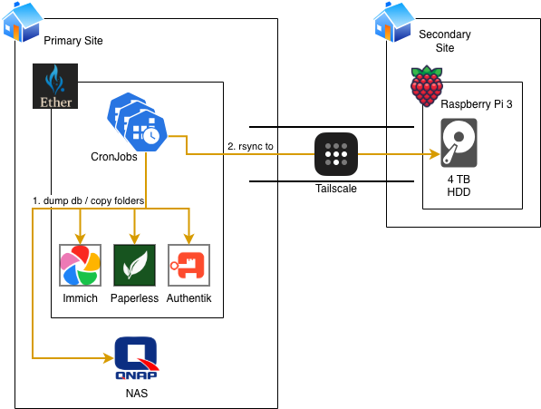

# Backups

This document describes the backup strategy and implementation for the Ether homelab. The backup system ensures data protection for all critical applications and services running in the Kubernetes cluster.

## Overview

The backup system implements a dual approach to data protection:
1. **Offsite Backups**: Critical data is backed up to a remote NAS device at a different physical location
2. **Local Backups**: Some data is also backed up locally for redundancy

All backups are performed using SSH-based rsync operations to a remote backup server.

## Backup Architecture

The backup system is implemented using Kubernetes CronJobs that run scheduled backup operations. The architecture is illustrated in the following diagram:



## Backup Components

### Offsite SSH Key

The backup system uses a dedicated SSH key for authentication with the offsite backup server:

- Private key: `immich-backup-key` (stored in `ssh-keys/immich-backup-key.enc`)
- Public key: `immich-backup-key.pub` (used for authorizing access)

The SSH key is configured in the `ansible/playbooks/offsite/authorize_immich_backup_ssh_key.yaml` playbook.

### Backup Jobs

Each application has dedicated backup jobs that handle both database and media data:

#### Immich

Immich has two backup jobs:
1. **Database Backup**: `immich-backup-db` - Dumps PostgreSQL database using `pg_dumpall`
2. **Media Backup**: `immich-backup-media` - Backs up media files using rsync

Backup location: `/mnt/backup/immich/`

#### Paperless

Paperless has three backup jobs:
1. **Database Backup**: `paperless-backup-db` - Dumps PostgreSQL database using `pg_dumpall`
2. **Media Backup**: `paperless-backup-media` - Backs up media files using rsync
3. **Redis Backup**: `paperless-backup-redis` - Backs up Redis data (if applicable)

Backup location: `/mnt/backup/paperless/`

#### Authentik

Authentik has one backup job:
1. **Database Backup**: `authentik-backup-db` - Dumps PostgreSQL database using `pg_dumpall`

Backup location: `/mnt/backup/authentik/`

#### NAS Backup

The NAS backup job (`nas-backup`) performs a full backup of critical data from the NAS storage:

- **Schedule**: Daily at 1:20 AM
- **Source**: Chosen directories in `/data` on NAS
- **Destination**: `/mnt/backup/data/` on the backup server
- **Notification**: Sends success notification to ntfy service

Backup location: `/mnt/backup/data/`

## Backup Process

All backup jobs:
1. Use Alpine Linux containers with rsync and SSH client installed
2. Authenticate using the offsite SSH key
3. Create destination directories on the backup server
4. Perform rsync operations to transfer data
5. Send notifications upon completion

## Backup Storage

All backups are stored on a remote NAS device in the `/mnt/backup/` directory structure. The backup server is configured to maintain backups for a specified retention period.

## Backup Schedule

The backup jobs run on a daily schedule:
- **Immich**: Database and media backups
- **Paperless**: Database, media, and Redis backups
- **Authentik**: Database backup
- **NAS**: Daily full backup

## Security

- SSH keys are encrypted using SOPS
- Backup jobs run with minimal required permissions
- All backup operations are logged and monitored
- Backup server access is restricted to authorized keys only

## Monitoring and Notifications

Successful backup operations send notifications to the ntfy service (`https://ntfy.nora/backups`) to alert on backup completion status.

## Troubleshooting

### Checking Backup Status

```bash
kubectl get jobs -n immich
kubectl get jobs -n paperless
kubectl get jobs -n authentik
kubectl get cronjobs -n nas-backup
```

### Viewing Job Logs

```bash
kubectl logs job/immich-backup-db -n immich
kubectl logs job/immich-backup-media -n immich
```