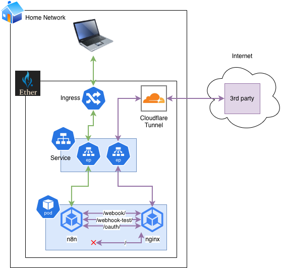

# n8n

[n8n](https://n8n.io/) is a powerful workflow automation tool that enables users to create automated workflows between different applications and services. In the Ether homelab, n8n is deployed as a Kubernetes application to automate various personal and professional tasks.

## Overview

n8n is used in the Ether homelab for automating a wide range of tasks, including:
- Integration between various self-hosted applications
- Automating document processing with PaperlessNGX
- Personal AI assistant functionality
- Workflow automation for both personal and family business use cases

## Deployment

n8n is deployed using ArgoCD as a Helm chart from the 8gears.container-registry.com/library repository. The deployment configuration is defined in the `argo/apps/n8n` directory.

### Configuration

The n8n deployment uses the following key configuration:

- **Version**: Helm chart version 2.0.1, image tag 2.3.4
- **Persistence**: Enabled with Longhorn storage class
- **Service**: Configured with custom nginx proxy for specific paths

### Helm Values

The n8n Helm values are configured with:
- Production environment settings
- Custom webhook URL for external integration
- Host configuration for n8n.nora domain
- SSL configuration
- Personalization and diagnostics settings disabled for security

## Architecture

The n8n deployment integrates with the existing Ether homelab architecture:

1. **Network Access**: n8n is accessible through the Tailscale network and Cloudflare tunnels
2. **Storage**: Uses Longhorn for persistent storage of workflow data
3. **Proxy Integration**: Configured with custom nginx proxy to handle specific paths for OAuth2 callbacks and webhook handling
4. **Security**: Integrated with the existing certificate management and security infrastructure

## Integration with Other Applications

In the Ether homelab, n8n is particularly integrated with:
- **PaperlessNGX**: Used for automating document processing workflows
- **Immich**: Integration for photo management workflows
- **Other self-hosted applications**: Various integrations for personal automation tasks

## Security Configuration

The n8n deployment follows the security practices of the Ether homelab:
- Uses TLS encryption for all communications
- Integrates with the existing certificate management system
- Configured with appropriate access controls
- Persistent storage with Longhorn for data replication
