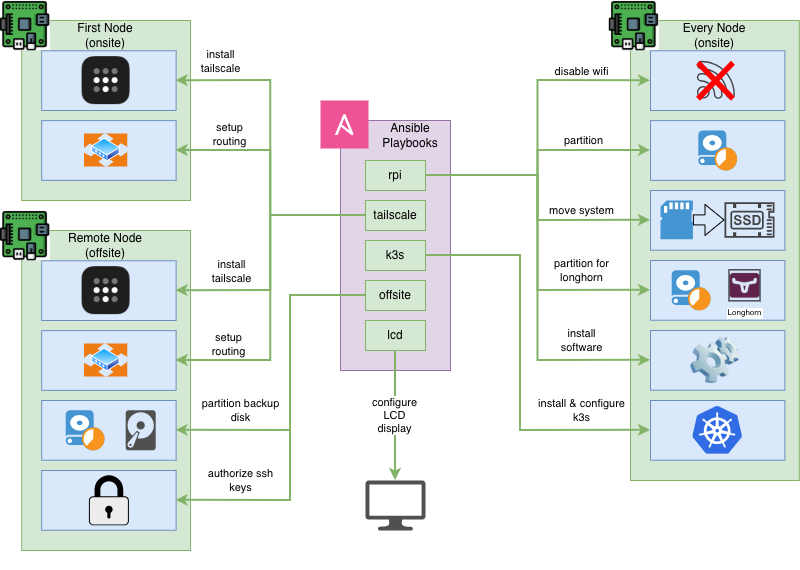

# Provisioning

Provisioning of the nodes is done with **Ansible**. The scripts can be found in the ansible directory.

## Provisioning phases

The starting point is a Raspberry Pi 5 with a regular Raspbian OS on an SD card, configured to connect to the local WiFi.

### Phase 1: Preparing the node

This phase is done with scripts in `ansible/playbooks/rpi`. These will perform the following:

1. Disable WiFi as we only want to use cable connections
2. Partition the attached NVMe drive with a boot partition and a root partition used for the system (for logs, etc.)
3. Cloning the system from the SD Card into the NVMe. After this the SD Card can be pulled out as it is no longer needed
4. Partition the rest of the NVMe drive into a partition dedicated to Longhorn
5. Install software that needs to live outside of k3s, such as the NFS client

### Phase 2: Install k3s

This phase is done with scripts in `ansible/playbooks/k3s` and will perform the following:

1. Install k3s server on the first node
2. Install k3s agents on the other nodes
3. Fetch a kubeconfig file to be used locally for connection

### Phase 3: Install Tailscale

This phase is done with scripts in `ansible/playbooks/tailscale` and will perform the following:

1. Install Tailscale on the master node
2. Enable routing on the master node and configure for the primary zone
3. Enable routing on the remote node and configure for the secondary zone

That folder also contains optional playbooks for clearing the routes, useful for debugging

### Phase 4: Offsite setup

Scripts for this phase are in `ansible/playbooks/offsite`. Those are optional scripts that can be used to:

* Authorize SSH keys (for example for `rsync` used for backup)
* Formatting the backup disk

### Phase 5: Optionals & eye candy

For now this only is used for installing Chromium on one of the nodes and setting up a Kiosk there to be displayed on the LCD screen